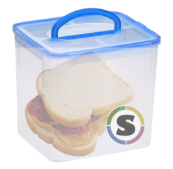

# ContainersFTW Competition



This is a containersFTW competition container base! If you are a competition host, you should [read complete instructions here](https://containers-ftw.github.io) for how to edit this template. You can fill in empty links in the description alone with links to the repos wiki (for background and data) or just add sections to the README, or a docs folder. It's up to you, as long as the participant can find it. You can feel free to remove this section and replace with an introduction to yours.


# MyContainersFTW Competition!

This is a competition based on [this really cool question](), provided here to encourage containerization of submissions by way of [Singularity](https://singularity.lbl.gov). If you aren't familiar with Singularity, it's a container (like Docker) that can be run securely on HPC architectures.


## Competition Overview

1. **Goals**: Read about the [data]() to get a breakdown of the data provided, and the [background and goals]() of the competition.
2. **Build**: Build your container (see build section below), which will install dependencies and prepare data for you. If you find that you need any more, or any additional software or libraries, you can add them to the `%post` section of the [Singularity](Singularity) file.
3. **Code**: Once you have your container built, you can use it to develop and test your submission.
4. **Submit**: A submission to the competition means submitting a PR (pull request)

### Goals
Evaluation for this competition is based on [my metric](). In addition to this criteria, the [evaluation]() includes multiple checks to ensure that the data are unbiased.


### Build
When you are ready to start your submission, you should fork the repo to your branch, and then clone the fork. For example, if my username on Github was `vsoch`, I would fork and then do:

```
git clone https://www.github.com/vsoch/mycontainers-ftw
cd mycontainers-ftw
```

Then you can build your image. You will need one dependency, that [Singularity is installed](https://singularityware.github.io). Building comes down to creating an image and then using `bootstrap` to build from the container recipe, [Singularity](Singularity).

```
singularity create --size 3000 container.ftw 
sudo singularity bootstrap container.ftw Singularity
```

### Code

3. Your data files are located at `/data` and the main script that should run to produce your data in a subfolder of `/code/analysis/results` (for testing input) should be located at `/code/main.py` in the container.

If you want to ever find data or results locations, these have been provided for you via environment variables:

 - `CONTAINERSFTW_DATA`: The base folder with data
 - `CONTAINERSFTW_RESULT`: The folder where results are written to
 - `CONTAINERSFTW_WORK`: The folder where your scripts live.

It's definitely a good idea if you are interested to shell around the container to understand where things are located.

### Adding Dependencies
If you add dependencies (another python module, additional data that conforms to competition rules, etc) you should update the Singularity recipe, for example, we have marked in `%post` where you can add installation steps:

```
     #########################################################
     # Install additional software / libraries here
     #########################################################

     pip install -y pokemon

     #########################################################
```

## FAQ

1. **Do I have to use the language provided?**: Of course not! The base template image given to use is based on a choice by the creator (for example, lots of people use `scikit-learn` in python for machine learning). At the end of the day, the evaluation is done over the text file in `/analysis/results/submission` and is ambivalent to how it is generated. Your submission (the container image) must simply run to generate it, and you are good.

For now, for additional FAQ please see our [documentation](https://containers-ftw.github.io)
